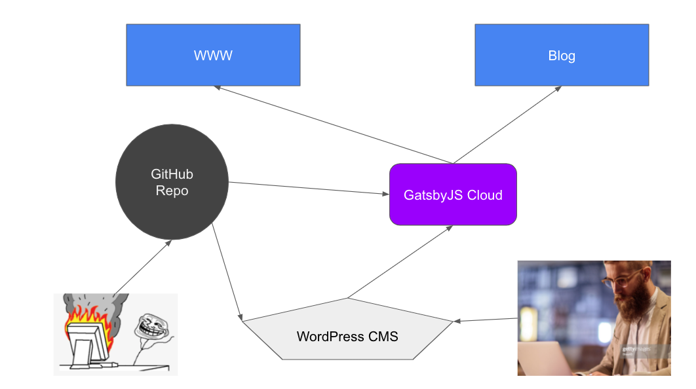

# Website X

## Overview

The primary technologies powering the new 2022 Website are a static site generated by Gatsby JS, with Wordpress behind the build for editors to build content. A basic layout of workflow is below.



### Design

The wireframes can be found [in the figma file](https://www.figma.com/proto/V3hokf6cak0yBVYYESdGj7/LVP_Wireframes?page-id=2061%3A1&node-id=6746%3A20632&viewport=321%2C48%2C0.07&scaling=scale-down-width&starting-point-node-id=6746%3A20632&show-proto-sidebar=1)

### Assets

TODO: Google Drive Link

# Issue Tracking


* Each page has its own card.
* Subsequent issues are tracked within these cards.
* The only time a card will move _back_ through the board is from **final review** to *edits pending*.

# Installation

## Prerequisites

### NPM
Install Node and NPM per their individual documentation.

### Composer
Install composer globally on your machine per documentation.

### Git
Duh.

## Gatsby CLI

```bash
npm i gatsby-cli -g
```

## Docsify CLI

```bash
npm i docsify-cli -g
```

## Initialization

### Validation

Lets verify that we have the necessary CLI apps running...

```bash
gatsby -v && docsify -v && npm -v && composer -V
```

### Project Dependancies

Before we can run anything locally, we need to install our dependencies.

```bash
composer install && npm install
```

# Development

## Commands

```bash
# Serve and run the main website locally
composer www

# Serve and run the blog project locally
composer blog

# Serve and run WordPress locally
composer wordpress

# Serve and run the doc page locally
composer docs
```

To add or edit these commands, they can be found in the `composer.json` file.

## Running Wordpress locally

This is only necessary when doing php/wordpress development. For local development, a sqlite database will be established automatically.

```bash
composer wordpress
```

When you run this for the first time and visit localhost:3000, you will be prompted to choose a language and create some site settings.

## Running GatsbyJS locally

> This will allow a developer to preview gatsby work before committing anything to the codebase.

### Running Gatsby

We have two projects in this repo, `www` and `blog`. There are shortcut commands for each of those projects. To run the `www` project locally, execute the command:

```bash
composer www
```

It will build, serve, and open the gatsby site.

### Content

By default, the site content used to build the local site will come from the published WordPress CMS content. If you'd like to run Gatsby using your local WordPress instance, you need to create a `.env` file at the root of this repo. It will be ignored by Git, so don't be concerned about that. Use this as a template:

```bash
####################################
##                                ##
##  .env file for local env vars  ##
##                                ##
####################################

WP_HOST=http://localhost:3000

# If you want wordpress to output critical errors and warnings while you work on it:
# WP_DEBUG=true

```

## Branch Structure

main, deploy

## Gutenberg Blocks

The LivePerson custom Gutenberg blocks for Wordpress can be found within the plugins directory `lp-guti-blocks`.

```
wordpress
└ www
  └ wp-content
	└ plugins
	  └ lp-guti-blocks
	    └ blocks
		| └ hero
		| └ left-right
		| └ (...)
		| |
		| | AddItemButton.js
		| | all.js
		| | BackgroundSelector.js
		| | HeadingFormat.js
		| | ItemControls.js
		| | LineBreaks.js
		└ build
		└ node_modules
		| .editorconfig
		| .gitignore
		| lp-guti-blocks.php
		| package-lock.json
		| package.json
		| readme.txt
```

The entrance point for all gutenberg blocks in this plugin is `all.js`

## Pages

### Dynamic Pages

By Default, all pages in wordpress are converted to Gatsby pages. A page in wordpress with the permalink `products/conversational`, for example, will result in a Gatsby page of the same url. Permalinks by default are the hyphened slugs that WordPress generates, but can be changed under "Permalink Manager"


### Fixed Pages

To create a static page in Gatsby, follow the standard procedure of creating the necessary JS file, for example, `example.js` under the pages directory in the gatsby site files.

### Pages from other web properties

We've built a script as part of the GatsbyJS build that allows you to consume a page from another web property and create its static mirror under the project at the same URL. Currently re-writing the url is not supported.

To do this, use the `./old-pages.json` file, it is an associative array (JSON object) of domains, each with a child array of pages to clone. Follow the format within, and you should be fine.

```json
{
    "example.domain.com": [
        "page",
	"another/page",
	"yet/another/page"
    ],
    "another.domain.com": [
        "youget/thepicture"
    ]
}
```

